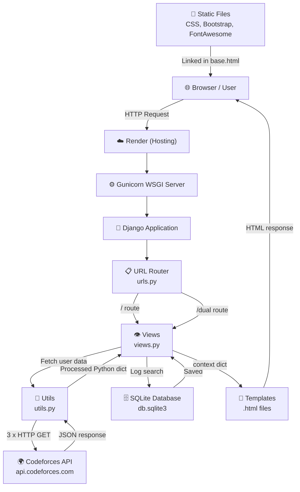

# ForceLens — Project Architecture

> A Codeforces Profile Analyzer built with Django. Allows users to view and compare competitive programming statistics fetched live from the Codeforces API.

---

## Table of Contents

1. [Project Overview](#1-project-overview)
2. [Directory Structure](#2-directory-structure)
3. [Architecture Diagram](#3-architecture-diagram)
4. [Request Lifecycle](#4-request-lifecycle)
5. [Layer-by-Layer Breakdown](#5-layer-by-layer-breakdown)
   - [URLs (Routing)](#51-urls-routing)
   - [Views (Controllers)](#52-views-controllers)
   - [Utils (Business Logic)](#53-utils-business-logic)
   - [Models (Database)](#54-models-database)
   - [Templates (UI)](#55-templates-ui)
   - [Settings (Configuration)](#56-settings-configuration)
6. [Codeforces API Integration](#6-codeforces-api-integration)
7. [Data Flow Diagrams](#7-data-flow-diagrams)
8. [Database Schema](#8-database-schema)
9. [Static Files & Styling](#9-static-files--styling)
10. [Deployment Architecture](#10-deployment-architecture)
11. [Known Limitations & Future Ideas](#11-known-limitations--future-ideas)

---

## 1. Project Overview

**ForceLens** is a two-feature web app:

| Feature | URL | Description |
|---|---|---|
| Single Profile Analyzer | `/` | Analyze one Codeforces user's stats |
| Dual Profile Comparison | `/dual` | Side-by-side comparison of two users |

**Tech Stack:**

| Layer | Technology |
|---|---|
| Backend Framework | Django 3.1 |
| Language | Python 3.9 |
| Database | SQLite (via Django ORM) |
| External API | Codeforces REST API |
| Frontend | Bootstrap 4, Font Awesome, Google Fonts |
| Production Server | Gunicorn |
| Static Files | WhiteNoise |
| Hosting | Render |

---

## 2. Directory Structure

```
force_lens/                          ← Git repository root
│
├── cf_profile_analyzer/             ← Django project root
│   │
│   ├── manage.py                    ← Django CLI entry point
│   │
│   ├── cf_profile_analyzer/         ← Django project config package
│   │   ├── settings.py              ← App configuration (DB, apps, middleware)
│   │   ├── urls.py                  ← Root URL dispatcher
│   │   ├── wsgi.py                  ← WSGI entry point (used by Gunicorn)
│   │   └── asgi.py                  ← ASGI entry point (async, unused)
│   │
│   └── analyzer/                    ← The main Django app
│       ├── models.py                ← Database models (UserName, Compare)
│       ├── views.py                 ← Request handlers (single, dual)
│       ├── utils.py                 ← Codeforces API calls + data processing
│       ├── urls.py                  ← App-level URL patterns
│       ├── admin.py                 ← Admin panel registrations
│       ├── migrations/              ← Database migration files
│       ├── static/css/master.css    ← Custom CSS
│       └── templates/analyzer/
│           ├── base.html            ← Shared layout (navbar, footer)
│           ├── single.html          ← Single profile page template
│           └── dual.html            ← Dual comparison page template
│
├── requirements.txt                 ← Python dependencies
├── Procfile                         ← Process start command (Gunicorn)
├── render.yaml                      ← Render deployment config
├── runtime.txt                      ← Python version pin for Render
├── .python-version                  ← Python version pin (alternate format)
├── vercel.json                      ← Vercel config (legacy, not used)
└── .gitignore                       ← Files excluded from git
```

---

## 3. Architecture Diagram



---

## 4. Request Lifecycle

Here is the step-by-step journey of a single user request (e.g., searching for handle `tourist`):

```
1. User opens browser → visits https://forcelens.onrender.com/
2. Render routes request → Gunicorn
3. Gunicorn passes request → Django WSGI app
4. Django middleware processes request (Security, Session, CSRF, Auth...)
5. Root urls.py matches "/" → delegates to analyzer/urls.py
6. analyzer/urls.py matches "" → calls views.single()
7. views.single() detects GET → renders blank form (single.html)

--- User types "tourist" and clicks "Go, Fetch!" ---

8. Browser sends POST request with {"handle": "tourist"}
9. Same path: Render → Gunicorn → Django → urls.py → views.single()
10. views.single() detects POST
11. Logs the username to SQLite via UserName.objects.create(...)
12. Calls utils.get_user_info("tourist")     → API call 1
13. Calls utils.get_contest_info("tourist")  → API call 2
14. Calls utils.get_submission_info("tourist") → API call 3
15. Builds context = {data, contest_info, submission_info}
16. Calls render(request, 'analyzer/single.html', context)
17. Django template engine fills in the HTML
18. HTTP 200 response with rendered HTML sent to browser
```

---

## 5. Layer-by-Layer Breakdown

### 5.1 URLs (Routing)

**Root dispatcher** — `cf_profile_analyzer/urls.py`
```python
urlpatterns = [
    path('admin/', admin.site.urls),  # Django admin panel
    path('', include('analyzer.urls'))  # All other routes → analyzer app
]
```

**App routes** — `analyzer/urls.py`
```python
urlpatterns = [
    path('', views.single, name='single'),   # Home page
    path('dual', views.dual, name='dual')    # Comparison page
]
```

Only 2 user-facing routes exist. The `name=` parameter allows reverse URL lookup in templates using ``.

---

### 5.2 Views (Controllers)

`analyzer/views.py` — The glue between the API layer and the templates.

#### `single(request)` — Single Profile View

```
GET  /   → Show empty form
POST /   → Fetch data for one handle, render results
```

**Step-by-step logic:**
1. Default: `data = contest_info = submission_info = ''`
2. On POST: extract `handle` from form
3. Log the search to DB (`UserName.objects.create(...)`)
4. Call `get_user_info(handle)` → if error, flash message and stop
5. Call `get_contest_info(handle)` and `get_submission_info(handle)`
6. Pass all three data dicts into `single.html` template

#### `dual(request)` — Dual Comparison View

```
GET  /dual  → Show empty form (two handle inputs)
POST /dual  → Fetch data for two handles, render side-by-side
```

**Key difference from single:** Handles both users, stops if either is invalid. Only proceeds to fetch contest/submission data if **both** profiles are valid.

---

### 5.3 Utils (Business Logic)

`analyzer/utils.py` — All Codeforces API calls and data processing logic.

#### `get_user_info(handle)` → Codeforces API: `user.info`

Fetches basic profile data for a handle.

**Returns dict with:**
| Key | Description |
|---|---|
| `rating` | Current rating (int or `"--"`) |
| `rank` | Current rank string (e.g., `"Legendary Grandmaster"`) |
| `maxRating` | All-time peak rating |
| `friendOfCount` | Number of friends |
| `titlePhoto` | URL to profile picture |
| `handle` | Codeforces handle |
| `curColor` | Color hex string for current rating |
| `maxColor` | Color hex string for max rating |

---

#### `get_contest_info(handle)` → Codeforces API: `user.rating`

Fetches full contest history.

**Returns dict with:**
| Key | Description |
|---|---|
| `ratings` | List of all ratings after each contest |
| `minRating` | Lowest ever rating |
| `minStanding` | Best rank ever in a contest (min rank number = best) |
| `maxStanding` | Worst rank ever |
| `minColor` | Color hex for min rating |

---

#### `get_submission_info(handle)` → Codeforces API: `user.status`

Fetches ALL submissions and computes statistics.

**Returns dict with:**
| Key | Description |
|---|---|
| `totalSub` | Total number of submissions |
| `successSub` | Accepted submissions |
| `failedSub` | Wrong/TLE/etc. submissions |
| `successRatio` | Percentage of AC submissions |
| `failedRatio` | Percentage of failed submissions |
| `topTags` | Top 5 problem tags by AC count |
| `topSuccessIndex` | Top 5 problem indices (A, B, C...) for AC |
| `topFailedIndex` | Top 5 problem indices for failures |

---

#### `choose_color(rating)` — Rating Color Mapper

Maps a numeric Codeforces rating to its canonical color:

| Rating Range | Color | Rank |
|---|---|---|
| < 1200 | `#808080` (Gray) | Newbie |
| 1200–1399 | `#008000` (Green) | Pupil |
| 1400–1599 | `#03a89e` (Cyan) | Specialist |
| 1600–1899 | `#0000ff` (Blue) | Expert |
| 1900–2099 | `#aa00aa` (Violet) | Candidate Master |
| 2100–2399 | `#ff8c00` (Orange) | Master / IM |
| 2400–2599 | `#ff0000` (Red) | Grandmaster |
| 2600+ | `#ff0000` (Red) | International/Legendary GM |

---

#### `get_top_five(dictionary)` — Helper

Takes a `{tag: count}` dict and returns only the top 5 entries by count.

---

### 5.4 Models (Database)

`analyzer/models.py` — Two models used for analytics/logging only. They do **not** affect the displayed data.

#### `UserName` — Logs single profile searches

| Field | Type | Purpose |
|---|---|---|
| `username` | CharField(64) | The searched handle |
| `date` | DateTimeField | Auto-set timestamp |
| `host` | CharField(155) | Server hostname |
| `ip_address` | CharField(155) | Requester's IP |

#### `Compare` — Logs dual profile comparisons

| Field | Type | Purpose |
|---|---|---|
| `user1` | CharField(64) | First handle |
| `user2` | CharField(64) | Second handle |
| `date` | DateTimeField | Auto-set timestamp |
| `host` | CharField(155) | Server hostname |
| `ip_address` | CharField(155) | Requester's IP |

> Both models are registered in `admin.py` and viewable at `/admin/`.

---

### 5.5 Templates (UI)

#### `base.html` — Shared Layout

Every page extends this. Contains:
- `<head>`: Bootstrap 4 CSS, Font Awesome icons, Google Fonts, custom `master.css`
- **Navbar**: CFPA brand logo (links to `/`), "Dual Profile" nav link (links to `/dual`), "Fork this repo" link
- `` — where page-specific content is injected
- **Footer**: GitHub profile icon link
- Bootstrap JS scripts

#### `single.html` — Single Profile Page

Extends `base.html`. Contains:
- A form with one text input (`name="handle"`) + submit button
- Django message block (shows errors like "user not found")
- Profile section: avatar, handle name, current rating (color-coded), rank
- Stats table: Min/Max rating, Min/Max contest rank, submission counts
- Top problem tags display
- Top problem difficulty index display (AC and Failed)

#### `dual.html` — Dual Profile Page

Extends `base.html`. Contains:
- A form with **two** text inputs (`name="first"`, `name="second"`)
- Two side-by-side columns comparing both users
- Same stat categories as single but shown in a comparison table format

---

### 5.6 Settings (Configuration)

`cf_profile_analyzer/settings.py` — Key configs:

```python
SECRET_KEY    = '...'           # Django secret (should be env var in production)
DEBUG         = True            # ⚠️ Should be False in production
ALLOWED_HOSTS = ['...']         # Includes .onrender.com, .vercel.app, etc.

INSTALLED_APPS = [
    ...django defaults...,
    'analyzer'                  # Our custom app
]

MIDDLEWARE = [
    'SecurityMiddleware',
    'whitenoise.WhiteNoiseMiddleware',  # Serves static files in production
    ...
]

DATABASES = {'default': {'ENGINE': 'sqlite3', 'NAME': BASE_DIR / 'db.sqlite3'}}

STATIC_URL  = '/static/'
STATIC_ROOT = BASE_DIR / 'staticfiles'   # Where collectstatic gathers files
STATICFILES_STORAGE = 'whitenoise.CompressedManifestStaticFilesStorage'
```

---

## 6. Codeforces API Integration

The app makes **3 sequential synchronous HTTP GET calls** per profile fetch using the `requests` library.

```
Base URL: https://codeforces.com/api/

Endpoints used:
├── user.info?handles={handle}    → Profile info
├── user.rating?handle={handle}   → Contest history
└── user.status?handle={handle}   → All submissions
```

**Error handling:**
- `user.info` returns `{"status": "FAILED", "comment": "..."}` for unknown handles — caught via `KeyError` and returned as `{"message": "handle does not exist."}`
- `user.status` wraps in try/except for `KeyError` to handle API failures gracefully

> ⚠️ **Performance note:** All 3 API calls are **synchronous and blocking**. For a single user, this means the page waits for all 3 calls sequentially before responding. For dual mode, all 6 calls happen before the page loads. On slow networks this can take 3-8 seconds.

---

## 7. Data Flow Diagrams

### Single Profile Search

```
POST /  {handle: "tourist"}
        │
        ▼
   views.single()
        │
        ├──► UserName.objects.create(...)  ──► SQLite (log)
        │
        ├──► get_user_info("tourist")
        │         └──► GET api/user.info?handles=tourist
        │                   └──► {rating, rank, maxRating, titlePhoto, ...}
        │
        ├──► get_contest_info("tourist")
        │         └──► GET api/user.rating?handle=tourist
        │                   └──► [{newRating, rank}, ...]
        │                         └──► {minRating, minStanding, ratings[]}
        │
        └──► get_submission_info("tourist")
                  └──► GET api/user.status?handle=tourist
                            └──► [{verdict, problem: {tags, index}}, ...]
                                  └──► {totalSub, successSub, topTags, ...}
        │
        ▼
   render('single.html', {data, contest_info, submission_info})
        │
        ▼
   HTML Response → Browser
```

---

## 8. Database Schema

```
┌────────────────────────────────────────┐
│            analyzer_username            │
├──────────────┬─────────────────────────┤
│ id           │ INTEGER PRIMARY KEY      │
│ username     │ VARCHAR(64)              │
│ date         │ DATETIME (auto)          │
│ host         │ VARCHAR(155) nullable    │
│ ip_address   │ VARCHAR(155) nullable    │
└──────────────┴─────────────────────────┘

┌────────────────────────────────────────┐
│            analyzer_compare             │
├──────────────┬─────────────────────────┤
│ id           │ INTEGER PRIMARY KEY      │
│ user1        │ VARCHAR(64)              │
│ user2        │ VARCHAR(64)              │
│ date         │ DATETIME (auto)          │
│ host         │ VARCHAR(155)             │
│ ip_address   │ VARCHAR(155)             │
└──────────────┴─────────────────────────┘
```

> **Note:** Django's default apps also create tables for sessions, auth, content types, and admin logs. Only `analyzer_username` and `analyzer_compare` are custom to this project.

---

## 9. Static Files & Styling

**Frontend dependencies (loaded via CDN):**
- **Bootstrap 4.4/4.5** — Layout grid, navbar, cards, badges
- **Font Awesome 4.1** — GitHub, LinkedIn, fork icons
- **Google Fonts** — `Do Hyeon` + `Rubik Mono One` for the CFPA brand

**Local static file:**
- `analyzer/static/css/master.css` — Custom overrides (brand colors, navbar styles)

**In production (Render):**
- `python manage.py collectstatic` gathers all static files into `staticfiles/`
- `WhiteNoiseMiddleware` serves them directly from Django (no separate Nginx needed)

---

## 10. Deployment Architecture

```
Developer Machine
      │
      │  git push origin main
      ▼
GitHub (Bikram-295/ForceLens)
      │
      │  Webhook triggers auto-deploy
      ▼
Render Build Server
  1. pip install -r requirements.txt
  2. python manage.py collectstatic --noinput
  3. python manage.py migrate
      │
      │  Build complete
      ▼
Render Web Service
  Start: gunicorn cf_profile_analyzer.wsgi:application
      │
      ▼
Live at: https://forcelens.onrender.com
```

**Key deployment files:**

| File | Purpose |
|---|---|
| `Procfile` | Tells Render/Heroku how to start the server |
| `render.yaml` | Render-specific build + start configuration |
| `runtime.txt` | Pins Python version to 3.9 |
| `.python-version` | Alternative Python version pin |
| `requirements.txt` | All Python dependencies |

---

## 11. Known Limitations & Future Ideas

### Current Limitations

| Issue | Description |
|---|---|
| **Synchronous API calls** | 3 blocking HTTP calls per user = slow page load (3-8s) |
| **No caching** | Same Codeforces data fetched fresh on every request |
| **SQLite on Render** | Ephemeral filesystem resets DB on each deploy |
| **DEBUG=True** | Should be `False` + use env variable in production |
| **Secret key exposed** | `SECRET_KEY` is hardcoded — should be an env variable |
| **No input validation** | Handle field has no client-side validation |

### Ideas for Improvement

| Feature | How |
|---|---|
| **Caching** | Use Django's cache framework (Redis/Memcache) to store API results for ~1hr |
| **Async API calls** | Use `asyncio` + `aiohttp` to fetch all 3 endpoints in parallel |
| **PostgreSQL** | Replace SQLite with Render's PostgreSQL for persistent logging |
| **Rating History Chart** | Use Chart.js to visualize the `ratings[]` list as a line graph |
| **More stats** | Language breakdown, problem difficulty distribution, streak tracking |
| **Error pages** | Custom 404/500 pages |
| **Env variables** | Move `SECRET_KEY` and `DEBUG` to environment variables |
